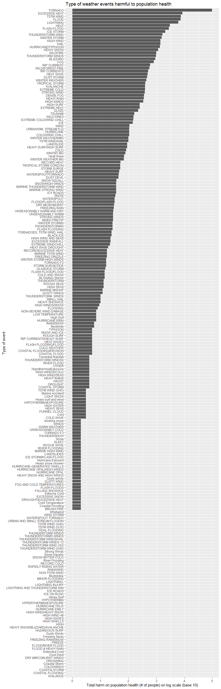
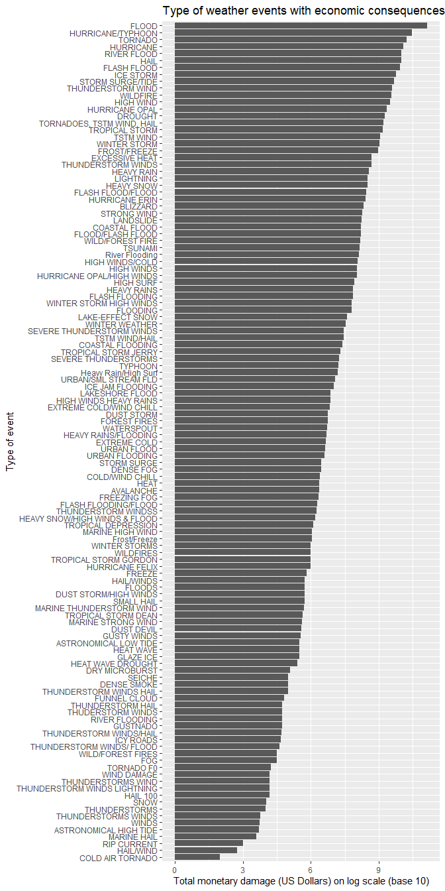

# Synopsis

In this report we aim to find the types of weather event that is most harmful to the population health of the U.S. and has the greatest economic consequences to the U.S. respectively. To answer these questions, we accessed the NOAA Storm Database to make an exploratory analysis on the "Storm Data" dataset. The dataset includes weather events recorded from the year 1950 to 2011, with the time of their occurrence, their scale, the fatalities and injuries caused and the property and crop damage they caused. From these data, we found that, judging from the number of people affected and the amount of money lost, tornadoes and floods are respectively the most harmful weather event with respect to population health and economy of the country.

# Data Processing

## Loading and preprocessing the data

The data will be read by `read.csv()` function directly from the `.csv.bz2` format.

```r
data <- read.csv("repdata_data_StormData.csv.bz2")
```

# Results

## Across the United States, Which types of events are most harmful with respect to population health?

The columns related to population health are the `FATALITIES` and `INJURIES` columns. The total value of fatalities and injuries is summed within each type of event (i.e., `EVTYPE`). The values are added together to yield the total harm to the population and the events with no fatalities and injuries are filtered out.  
Finally, we use `max()` function and `which()` function to find the maximal value of total harm and retrieve its position in the list to find out the event at which the maximum occurs.


```r
library(dplyr)
```

```
## 
## Attaching package: 'dplyr'
```

```
## The following objects are masked from 'package:stats':
## 
##     filter, lag
```

```
## The following objects are masked from 'package:base':
## 
##     intersect, setdiff, setequal, union
```

```r
data_health <-
    data %>%
    select(EVTYPE, FATALITIES, INJURIES) %>%
    group_by(EVTYPE) %>%
    summarise(total_fatalities = sum(FATALITIES), total_injuries = sum(INJURIES), total_harm = total_fatalities + total_injuries) %>%
    filter(total_harm != 0)

max_harm <- max(unlist(data_health[,"total_harm"]))
max_harmind <- which(data_health[,"total_harm"] == max_harm)
harm_type <- data_health[max_harmind,"EVTYPE"]
```

TORNADO is the most harmful event with respect to population health. We can also see this from the bar plot drawn with the dataset below. For the sake of plotting, the dataset is arranged in ascending order w.r.t. the total harm and log10 is taken on `total_harm`. The `ggplot2` package is used to create a horizontal bar plot that starts from the most harmful event.


```r
library(ggplot2)
library(dplyr)
```

```
## 
## Attaching package: 'dplyr'
```

```
## The following objects are masked from 'package:stats':
## 
##     filter, lag
```

```
## The following objects are masked from 'package:base':
## 
##     intersect, setdiff, setequal, union
```

```r
data_health <-
    data_health %>%
    arrange(total_harm) %>%
    mutate(log_ttlharm = log10(total_harm)) %>%
    mutate(refnum = 1:nrow(data_health))

ggplot(data_health, aes(x = reorder(EVTYPE, refnum), y = log_ttlharm)) +
    geom_bar(stat = "identity") +
    coord_flip() +
    labs(title = "Type of weather events harmful to population health", x = "Type of event", y = "Total harm on population health (# of people) on log scale (base 10)")
```



## Across the United States, which types of events have the greatest economic consequences?

The columns related to economic consequences are the `PROPDMG`, `PROPDMGEXP`, `CROPDMG` and `CROPDMGEXP` columns. After selecting these relevant columns, we first deal with the magnitude signifying "characters".


```r
data_econ <-
    data %>%
    select(EVTYPE, PROPDMG, PROPDMGEXP, CROPDMG, CROPDMGEXP)

#Understand the types of magnitude signifying "characters" in the dataset.
sign <- unique(append(unique(data_econ$PROPDMGEXP), unique(data_econ$CROPDMGEXP)))
```

According to Section 2.7 of the documentation, the alphabetical character signifying the magnitude of monetary damage include "K", "M" and "B". However, from the previous code chunk, we see that K, M, , B, m, +, 0, 5, 6, ?, 4, 2, 3, h, 7, H, -, 1, 8, k exist in the `PROPDMGEXP` and `CROPDMGEXP` columns. We would thus filter them out and only keep the entries with "K", "k", "M", "m" and "B". Then, we use a for loop to loop through each row of the dataset and calculate the monetary damages to property and crop. To save calculation time, they are saved in two lists first and concatenated with the datasets. Finally, they are summed up to yield the total economic consequence.


```r
data_econ <-
    data_econ %>%
    filter(PROPDMGEXP == "K" | PROPDMGEXP == "k" | PROPDMGEXP == "M" | PROPDMGEXP == "m" | PROPDMGEXP == "B") %>%
    filter(CROPDMGEXP == "K" | CROPDMGEXP == "k" | CROPDMGEXP == "M" | CROPDMGEXP == "m" | CROPDMGEXP == "B")

col_len <- nrow(data_econ)
propdmg <- rep(0,col_len)
cropdmg <- rep(0,col_len)

for(i in 1:col_len){
    if(data_econ[i,"PROPDMGEXP"] == "K" | data_econ[i,"PROPDMGEXP"] == "k"){
        propdmg[i] <- data_econ[i,"PROPDMG"] * 10^3
    }
    else if(data_econ[i,"PROPDMGEXP"] == "M" | data_econ[i,"PROPDMGEXP"] == "m"){
        propdmg[i] <- data_econ[i,"PROPDMG"] * 10^6
    }
    else if(data_econ[i,"PROPDMGEXP"] == "B"){
        propdmg[i] <- data_econ[i,"PROPDMG"] * 10^9
    }
}

for(i in 1:col_len){
    if(data_econ[i,"CROPDMGEXP"] == "K" | data_econ[i,"CROPDMGEXP"] == "k"){
        cropdmg[i] <- data_econ[i,"CROPDMG"] * 10^3
    }
    else if(data_econ[i,"CROPDMGEXP"] == "M" | data_econ[i,"CROPDMGEXP"] == "m"){
        cropdmg[i] <- data_econ[i,"CROPDMG"] * 10^6
    }
    else if(data_econ[i,"CROPDMGEXP"] == "B"){
        cropdmg[i] <- data_econ[i,"CROPDMG"] * 10^9
    }
}

data_econ <-
    data_econ %>%
    mutate(PROPDMGRES = propdmg) %>%
    mutate(CROPDMGRES = cropdmg) %>%
    mutate(DMG = PROPDMGRES + CROPDMGRES)
```

The total value of damage is summed within each type of event (i.e., `EVTYPE`) and the types of event with zero dollars of damage are filtered out. Likewise, we use `max()` function and `which()` function to find the maximal value of total damage and retrieve its position in the list to find out the event at which the maximum occurs.


```r
econ_sum <-
    data_econ %>%
    group_by(EVTYPE) %>%
    summarise(total_damage = sum(DMG)) %>%
    filter(total_damage != 0)

max_econ <- max(unlist(econ_sum[,"total_damage"]))
max_econind <- which(econ_sum[,"total_damage"] == max_econ)
econ_type <- econ_sum[max_econind,"EVTYPE"]
```

FLOOD has the greatest economic consequences. We can also see this from the bar plot drawn with the dataset below. For the sake of plotting, the dataset is arranged in ascending order w.r.t. the total damage and log10 is taken on `total_damage`. The `ggplot2` package is used to create a horizontal bar plot that starts from the most harmful event.


```r
econ_sum <-
    econ_sum %>%
    arrange(total_damage) %>%
    mutate(log_ttldmg = log10(total_damage)) %>%
    mutate(refnum = 1:nrow(econ_sum))

ggplot(econ_sum, aes(x = reorder(EVTYPE, refnum), y = log_ttldmg)) +
    geom_bar(stat = "identity") +
    coord_flip() +
    labs(title = "Type of weather events with economic consequences", x = "Type of event", y = "Total monetary damage (US Dollars) on log scale (base 10)")
```


